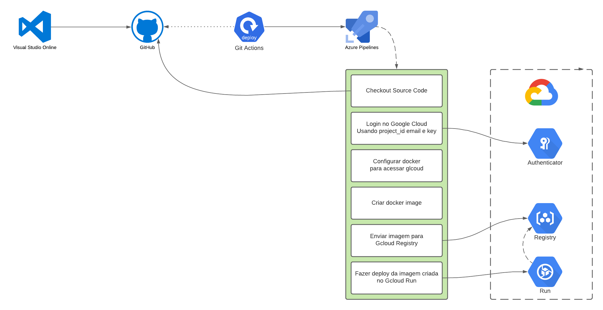

# DevOps - Como fazer Deploy com Git Actions e Google Cloud (GCP)

Video
https://www.youtube.com/watch?v=QXs78sFNIHY

Repositório do projeto
https://github.com/geandeveloper/helloworld-geandeveloper

## Projeto

